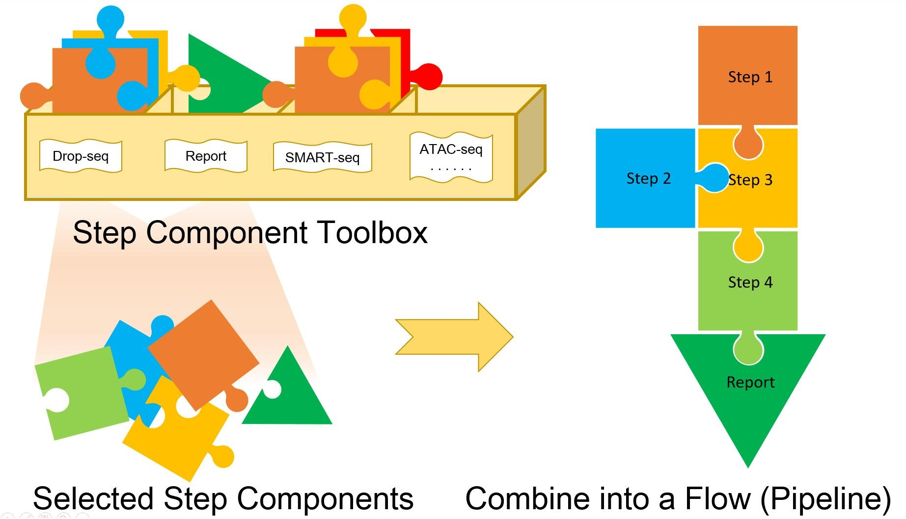
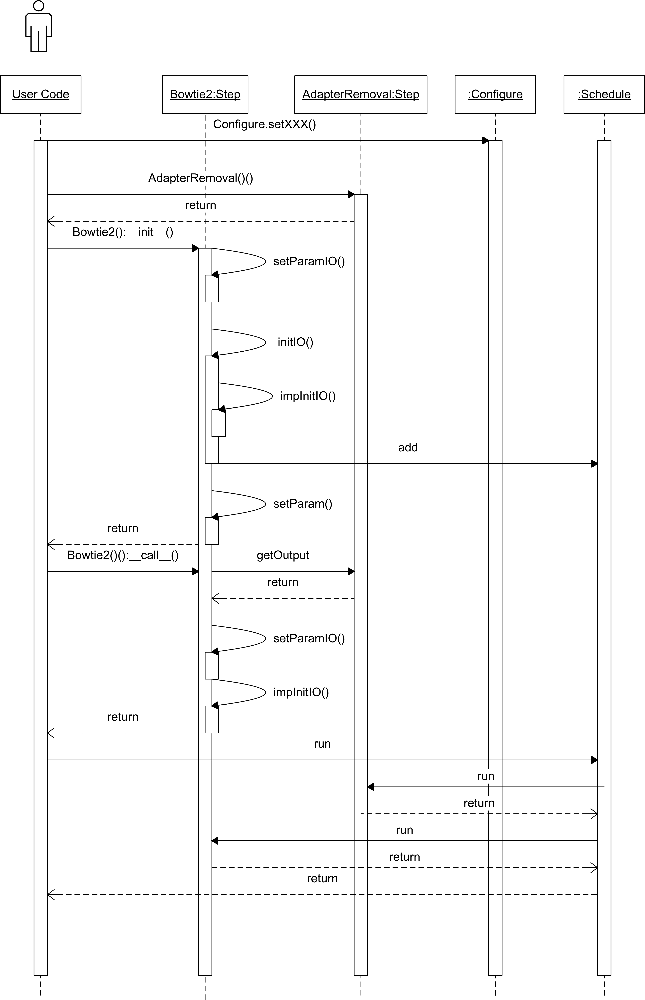

```{r setup, include=FALSE}
knitr::opts_chunk$set(echo = TRUE)
```

# Introduction
A wide variety of single cell sequencing, including single cell RNA-seq (scRNA-seq) and single cell ATAC-seq (scATAC-seq), are rapidly developing and improving. Hence, the corresponding reproduce-able data processing pipelines are in great demand. Many pipelines have been developed such as Granatum[1], ASAP[2], Seurat[3] and so on. However, all of them contain partial functions of the whole pipeline and all functions are not flexible for expanding, transfer, or reuse in new pipelines. Here, propose a componentized framework for single cell pipeline developing.   




## Step Component Toolbox

In this framework, each processing step like reads filtering, alignment, etc. is packaged into a componentized `Step` object. The `Step` objects provide standardized interface for parameters and data passing from or to other `Step` objects. They can only start from valid upstream `Step` objects. So users only need to focus on assemble the steps they need rather than caring about input and output of each `Step` object at the same time. All of them are in one Step Component Toolbox. If there are two pipelines share a same processing step, the developer can easily reuse the object to the other pipeline. 


## Flow: Standardized Pipeline

Users can not only assemble their own pipeline easily but also use standardized `Flow` assembled by developer. Developer  repackage the `Step` objects into some standardized ready-to-use `Flow` objects for some important pipelines and reproduce-able published work. In this way, user can use one command line reproduce other work or use the published pipeline for own data. The results will be compare-able and more meaningful.


# Package Structure

* hcacn
    + core
        - FlowBase.py # contain `Flow` base class
        - GraphMng.py # contain graph manage classed for step and flow
        - StepBase.py # contain Configure, Schedule and `Step` base class
    + flows	
        - Flow classes inherit from class in FlowBase.py
    + rscript	
        - The R script to be used in the steps
    + steps
        - Step classes inherit from class in StepBase.py

# Global Configure

For each pipeline, genome data (genome sequence, gene annotations, etc.) and software settings (thread number depends on computer cpu cores number, docker image versions, etc), should be available to be configured. So this framework provide getter and setter methods of `Configure` Class to configure and obtain the attributes and their values. If users or developer configure these attributes, they do not set

## Genome Data

All genome data files are storaged in one directory. We call it reference directory. There are many species and several genome assembly version for each species (e.g.human: hg19, hg38; mouse: mm9, mm10). In this framework, developer and user can set and get the reference directory and genome assembly version like this:

```{python eval=FALSE}
from hcacn.core import Configure

# set reference directory
Configure.setRefDir('your/reference/dir')

# set genome
Configure.setGenome('hg19')

# get reference directory
refdir = Configure.getRefDir()

# get genome
genome = Configure.getGenome()

```

The file names share genome prefix. Take hg19 genome files(only show genome sequence and bowtie2 index files here) as example:

* hg19.fa
* hg19.1.bt2
* hg19.2.bt2
* hg19.3.bt2
* hg19.4.bt2
* hg19.rev.1.bt2
* hg19.rev.2.bt2

The developer or user should rename them following the format and put them under the directory that will be used. The reference data can also be download from the link distributed by us (link)[http://bioinfo.au.tsinghua.edu.cn].


## Software Settings

### Performance

To utilize the computer hardware like CPU cores and RAM, run more threads at one time in the pipeline will greatly improve performance. We recommend that the max thread size number should not be greater than CPU core numbers in the computer. Besides, more threads will consume more emery so if the memory is not enough for the number of threads, less threads size should be configured. The default value of thread size is 2. User and developer can set and get thread size like this:

```{python eval=FALSE}
from hcacn.core import Configure

# If there is 8 CPU cores in your computer:
Configure.setThreads(8)

# get thread number
threadsize = Configure.getThreads()

```


### Docker Configuration

All  packaged software will run in docker. User do not need to configure docker because they use the newest version of installed docker image (the default docker attributes value in this framework). For developer, however, they need to package new `Step` and install new software to the image. Hence the version of the image should be selected. On test machine, more than one developer will test the code at the same time so the identity for each developer should be configured to avoid conflict in a same docker image copy. 

```{python eval=FALSE}

# if the image name is version.xxx.xxx and you wan to rename it as xxx:
Configure.setDockerVersion('versionxxx.xxx','xxx')

# get all configured versions
versions = Configure.getDockerVersions()

# get name for a version
versionName = Configure.getDockerVersions('version.xxx.xxx')


# set a identity for you, e.g. yourName
Configure.setIdentity('youName')

# get identity
identity = Configure.getIdentity()

```

### Intermediate Result

The pipeline will generate many intermediate results during the data processing in each step. In this framework, a directory can be configured for intermediate result storage (default directory is current directory).


```{python eval=FALSE}

# set temporary directory for intermediate result storage
Configure.setTmpDir('your/tmp/dir')

#get temporary directory
tmpdir = Configure.getTmpDir()

```


# Develop Step Classes
In this framework, the software that will be used in the pipeline will be packaged respectively. In this section, we will take the simplest pipeline with only two steps,'AdapterRemoval' and 'Bowtie2', as an example to explain how to wrap the software into a step. 


Software 'AdapterRemoval' and 'Bowtie2' need to be packaged into 2 child classes, `AdapterRemoval` and `Bowtie2`, which inherit from  class `Step`. The code and figure below to show how the steps work.

```{python eval=FALSE}
from hcacn.core import Configure, Schedule
from hcacn.steps import *

Configure.setRefDir('/ref/dir')
Configure.setGenome('hg19')
Configure.setIdentity('ATAC')
Configure.setThreads(8)

adrm = AdapterRemoval()(fastqInput1 = 'data_1.fastq',fastqInput2 = 'data_2.fastq')

rs = Bowtie2()(adrm)

Schedule.run()
```





First, user configure some attributes like threads, genome, etc.. Second, user generate and assemble the `AdapterRemoval` and `Bowtie2` objects. The first group of brackets after class new is to generate object, which call the `__init__()` construction function of the class. While the second ones is to pass upstream `Step` object(`AdapterRemoval`) outputs, which call the `__call__()` function of the class.  At last user call `Schedule.run()` to run the assembled pipeline. The figure only show details of `Bowtie2`. Details for `AdapterRemoval` are similar to `Bowtie2`

## Class Inherit and Definition

Among the inherited functions, developer need to implement 4 functions:

* \_\_init\_\_(): initialize the parameters
* impInitIO():  set input and output files paths of the software
* call(): transfer outputs of upstream steps as inputs of this step
* _singleRun()/multiRun: execute command line in docker
* getMarkdownEN(): to get markdown script for report generation

```{python eval=FALSE}
class Bowtie2(Step):
    def __init__(self,
                 fastqInput1 = None, 
                 fastqInput2 = None, 
                 bt2Idx = None,                 
                 samOutputDir = None, 
                 mapRsOutputDir = None,
                 threads = None,
                 isdovetail = True,
                 isNoDiscordant = True,
                 isNoUnal = True,
                 isNoMixed = True,
                 X = 2000,
                 cmdParam = None, 
                 **kwargs):
        pass
    def impInitIO(self,): 
        pass
        
    def call(self, *args):
        pass
        
    def _singleRun(self, i):
        pass

    def getMarkdownEN(self,):
        pass


```


In `Step`, there are 4 members for data storage:

* params: the parameters from constructor exclude parameters related to inputs and outputs 
* paramsIO: the parameters from constructor related to inputs and outputs 
* inputs: path for each input file (file path will be checked by framework)
* outputs: path for each output file (file path will be checked by framework)

`Step` provides methods to operate these members:

| data storage member | get operator                  | set operator                  |
|---------------------|-------------------------------|-------------------------------|
| inputs              | getInput()/ getInputXXX()     | setInput()/ setInputXXX()     |
| outputs             | getIOutputs()/ getOutputXXX() | setIOutputs()/ setOutputXXX() |
| params              | getParams()                   | setParams()                   |
| paramsIO            | getParamsIO()                 | setParamsIO()                 |


## Implement Constructor

(__1__) list all necessary parameters 

Usually, most parameter of the software can be fixed because rarely user would like to adjust the parameter. Less parameters will simplify usage block. Besides, all of the parameters should have its default value. So the value can be passed from upstream steps.


(__2__) fill all input and output parameter to the object member: paramsIO

Use `self.setParamIO('the parameter key you will use', parameter value)` to fill value.

(__3__) call `self.initIO()`

(__4__) fill all control parameter to the object member: params

Use `self.setParam('the parameter key you will use', parameter value)` to fill value.
If some value is `None`(like threads in this example), it has to refer to global configured value. 

```{python eval=FALSE}
def __init__(self,
            #input parameters
            fastqInput1 = None, 
            fastqInput2 = None, 
            bt2Idx = None,     
            #output parameters
            samOutputDir = None, 
            mapRsOutputDir = None,
            #control parameters
            threads = None,
            isdovetail = True,
            isNoDiscordant = True,
            isNoUnal = True,
            isNoMixed = True,
            X = 2000,
            #other parameters
            cmdParam = None, 
            **kwargs):
        pass
            
        Configure.setRefSuffix('bt2Idx','',check=False)
        Configure.setRefSuffix('bt2IdxFiles',['.1.bt2','.2.bt2','.3.bt2','.4.bt2','.rev.1.bt2','.rev.2.bt2'])
        # set all input and output parameters
        self.setParamIO('fastqInput1',fastqInput1)
        self.setParamIO('fastqInput2',fastqInput2)
        self.setParamIO('bt2Idx',bt2Idx)         
        self.setParamIO('samOutputDir',samOutputDir)
        self.setParamIO('mapRsOutputDir',mapRsOutputDir)    

        # call self.initIO()
        self.initIO()
            
        #set other parameters
        self.setParam('isNoDiscordant', isNoDiscordant)
        self.setParam('isNoUnal', isNoUnal)
        self.setParam('isNoMixed', isNoMixed)
        self.setParam('isdovetail', isdovetail)
        self.setParam('X', X)
        if threads is None:
            threads = Configure.getThreads()
        self.setParam('threads',threads)    
    

```


## Generate inputs and outputs list


This function,`impInitIO()`, will be call by `self.initIO()`. Its main function is to fill inputs and outputs member. Because the input or output parameter can be a folder, which may contain several files for each cell, or a single file, so the developer has to transform them as several file paths. If some value is `None`(like bt2Idx in this example), it has to refer to global configured value.

(__1__) obtain all input and output parameters 

Use `self.getParamIO('the parameter key you use')` to obtain the value.

(__2__) set all input file paths

The input files include the files that provided by user or upstream steps and the reference files that can be obtain by `Configure` class. Use `self.setInput('the parameter key you will use', input value)` or `self.setInputXXX('the parameter key you will use', input value)` depends on the type of your input parameter (folder with different type of files, folder with same files from different cells, single file, etc.) 

(__3__) set all output file paths

The output files include all files that expected to be generated by the software. Use `self.setOutput('the parameter key you will use', input value)` or `self.setOutputXXX('the parameter key you will use', input value)` depends on the type of your input parameter (folder with different type of files, folder with same files from different cells, single file, etc.) 

(__4__) set available upstream steps size (optional, default is 1)

Call `self._setUpstreamSize(integer: upstream size number)` to set upstream steps size.

(__5__) set `_multiRun` or `_singleRun` that will be used (optional, default is _singleRun)

Call `self._setMultiRun(True)` to enable `multiRun` function and disable `singleRun` function.

(__6__) if not call self._setMultiRun(True), it is necessary to set cell number for schedule

Call `self._setInputSize(100)`, if the cell number is 100.


```{python eval=FALSE}
def impInitIO(self,):
        """
        This function is to initialize 
        all of the input and output files from the io parameters set in __init__() 
        """
        
        # obtain all input and output parameters        
        fastqInput1 = self.getParamIO('fastqInput1')
        fastqInput2 = self.getParamIO('fastqInput2')
        bt2Idx = self.getParamIO('bt2Idx')        
        samOutputDir = self.getParamIO('samOutputDir')
        mapRsOutputDir = self.getParamIO('mapRsOutputDir')

        #set all input files        
        self.setInputDirOrFile('fastqInput1',fastqInput1)
        self.setInputDirOrFile('fastqInput2',fastqInput2)      
       
        #some special input from __init__ or configure
        if bt2Idx is None:
            self.setInput('bt2IdxFiles', Configure.getConfig('bt2IdxFiles')) 
            self.setParamIO('bt2Idx', Configure.getConfig('bt2Idx'))
        else:
            suffix = ['.1.bt2','.2.bt2','.3.bt2','.4.bt2','.rev.1.bt2','.rev.2.bt2']
            bt2IdxFiles = [ bt2Idx + s for s in suffix ]
            self.setInput('bt2IdxFiles', bt2IdxFiles)

        # create output file paths and set
        if samOutputDir is None:
            self.setParamIO('samOutputDir',Configure.getTmpDir())
        if mapRsOutputDir is None:
            self.setParamIO('mapRsOutputDir',Configure.getTmpDir())
        self.setOutputDir1To1('samOutput', samOutputDir,None,'sam','fastqInput1') 
        self.setOutputDir1To1('mapRsOutput',mapRsOutputDir,None,'result.txt','fastqInput1')
        
        # set how many sample are there
        if fastqInput1 is not None:
            self._setInputSize(len(self.getInputList('fastqInput1')))
```


## Transfer Outputs from Upstream Steps

`call()` function is call by `__call__()`. `args[0]` is the first upstream `Step` object (only one available upstream object here). Use `getOutput` method of upstream object to obtain outputs and fill the paramsIO object through `setParamIO` method.

```{python eval=FALSE}
def call(self, *args):
        """
        called by Bowtie2()(upstreamObj)
        """
        # the first object
        fastqUpstream = args[0]      
        
        # set all required input parameters from upstream object
        self.setParamIO('fastqInput1',fastqUpstream.getOutput('fastqOutput1'))
        self.setParamIO('fastqInput2',fastqUpstream.getOutput('fastqOutput2'))


```

### Execution

In this section, `_multiRun' or '_singleRun` will be implemented depends on previous configuration.

(__1__) obtain all input and output parameters 

(__2__) generate the command lines

(__3__)  call `self.callCmdline` to execute the command line


```{python eval=FALSE}
def _singleRun(self, i):
        """
        create and execute the command line        
        i is the No. of the sample
        """
        #get all input and output
        fastqInput1 = self.getInputList('fastqInput1')
        fastqInput2 = self.getInputList('fastqInput2')
        samOutput = self.getOutputList('samOutput')
        mapRsOutput = self.getOutputList('mapRsOutput')
        bt2IdxFiles = self.getInput('bt2IdxFiles')            
        #combine the command line
        cmdline = [#'/root/software/bowtie2-2.3.4.1-linux-x86_64/bowtie2',
                'bowtie2',
                '-p', str(self.getParam('threads')),
                self.getBoolParamCmd('--dovetail ', 'isdovetail'),
                self.getBoolParamCmd('--no-discordant ','isNoDiscordant'),
                self.getBoolParamCmd('--no-unal ','isNoUnal'),
                self.getBoolParamCmd('--no-mixed ','isNoMixed'),
                '-X' , str(self.getParam('X')),
                self.getUnsetParams(),
                ' -x %s -q -1 %s -q -2 %s -S %s '%(
                    self.getParamIO('bt2Idx'),
                    #bt2IdxFiles[0],
                    fastqInput1[i],
                    fastqInput2[i],
                    samOutput[i]),
                ]
        
        #run commandline           
        result = self.callCmdline('V1',cmdline,stdoutToLog = True)
        #result = self.callCmdline(cmdline,stdoutToLog = False)
        
        #optional
        f = open(self.convertToRealPath(mapRsOutput[i]),'wb')   
        f.write(result.stdout)
        f.write(result.stderr)
```


## Generate Markdown Text for Report

In this function, a markdown text for Report generation will be returned. Use `##` for section title. Use `self.getOutput` to dynamic complement the template.


```{python eval=FALSE}
def getMarkdownEN(self,):
        logfile = self.getLogPath()

        mdtext ="""
## Bowtie2 Mapping Result
\```{{r eval=TRUE, echo=FALSE, warning=FALSE, message=FALSE}}
lines <- readLines("{logfile}")
mapping_rate <- c()
for(i in seq(lines)){{
    if(grepl(pattern = "overall alignment rate", x = lines[i], fixed = TRUE)){{
        tmp_line <- strsplit(x = lines[i], split = "\\\\s")
        tmp_line <- unlist(lapply(tmp_line, function(x){{x[!x ==""]}}))
        idx <- which(tmp_line == "overall") - 1
        mapping_rate <- c(mapping_rate, tmp_line[idx])
    }}
}}
mapping_rate <- as.numeric(sub("%", "", mapping_rate, fixed=TRUE))
idx1 <- which(mapping_rate < 30)
idx2 <- which((mapping_rate >= 30) & (mapping_rate <= 70))
idx3 <- which(mapping_rate > 70)
per1 <- length(idx1)/length(mapping_rate)
per2 <- length(idx2)/length(mapping_rate)
per3 <- length(idx3)/length(mapping_rate)
\```
The number of sample is `r length(mapping_rate)`, the average mapping rate is `r mean(mapping_rate)`%.
There are  `r round(per1*100, 2)`% sample mapping rate is less than 30%.
There are  `r round(per2*100, 2)`% sample mapping rate is between 30% ~ 70%.
There are  `r round(per3*100, 2)`% sample mapping rate is more than 70%.
        """.format(logfile=logfile)
        return mdtext

```

# Develop Flow Classes

The primary user would like to run the pipeline in only one command line so some standard and frequently us pipeline should be ready for use. In this section, assembling the steps into a flow class will be introduced. We will continue using the example in Develop Step Classes section. 


```{python eval=FALSE}

from hcacn.core import Configure,Schedule
from hcacn.flows import FlowExample
Configure.setIdentity('your identity')

rs=FlowExample(
    fastqInput1='./minidata/atac/end1',
    fastqInput2='./minidata/atac/end2',
    refdir='hca/ref/hg19_bowtie2',
    genome='hg19',
    threads=4,
    resultDir='result/')()

```


## Class Inherit and Definition

Among the inherited functions, developer need to implement 4 functions:

* \_\_init\_\_(): initialize the parameters
* _call(): transfer outputs of upstream flows as inputs of this flow
* _build(): assemble the steps
* _copy(): copy the important result to desalinate directory


```{python eval=FALSE}

from hcacn.core import Flow

class FlowExample(Flow):
    def __init__(self,
                 fastqInput1,
                 fastqInput2,
                 refdir, 
                 genome, 
                 resultDir='./result',                  
                 threads=None,                 
                 adapter1 = None,
                 adapter2 = None,
                 X = 2000,):
        pass
        
    def _call(self,*args):
        pass
    
    def _build(self,):
        pass
        
    def _copy(self,):
        pass
```


## Implement Constructor


The class inherit from `Flow`. The parameters need to be select one more time based on the steps parameters. Only most important  and necessary parameter should be set.

Use `self._setParam` to fill parameters to object member.

```{python eval=FALSE}

def __init__(self,
                 # input and output
                 fastqInput1,
                 fastqInput2,
                 # global parameters (necessary)
                 refdir, 
                 genome, 
                 resultDir='./result',                  
                 threads=None, 
                 # control parameters
                 adapter1 = None,
                 adapter2 = None,
                 X = 2000,):
        super(FlowExample,self).__init__(resultDir=resultDir, 
                                         refdir=refdir, 
                                         genome=genome, 
                                         threads=threads)
        self._setParam('fastqInput1',fastqInput1)
        self._setParam('fastqInput2',fastqInput2)
        self._setParam('adapter1',adapter1)
        self._setParam('adapter2',adapter2)
        self._setParam('X',X)
        

```


## Transfer Outputs from Upstream Flows

If there is not any upstream, just `pass` is OK. 
Otherwise use `self._setParam` to fill the member.

```{python eval=FALSE}
def _call(self,*args):
        # args[0]._getObj('FastqDump').getOutput('fastqOutput')
        pass

```


## Assemble Steps into Pipeline 

(__1__) obtain the parameters through `self._getParam()`

(__2__) assemble the steps include `Report` class, which also inherit from `Step`

(__3__) fill the steps list  through `self._setObj()`


```{python eval=FALSE}

def _build(self,):
        fastqInput1 = self._getParam('fastqInput1')
        fastqInput2 = self._getParam('fastqInput2')
        adapter1 = self._getParam('adapter1')
        adapter2 = self._getParam('adapter2')
        X = self._getParam('X')
        
        adrm = AdapterRemoval(fastqInput1=fastqInput1, fastqInput2=fastqInput2,
                              adapter1=adapter1, adapter2=adapter2)
        bt = Bowtie2(X=X)(adrm)
        
        rp = Report()
        rp.add('Section for AdapterRemoval',[adrm])
        rp.add('Section for Bowtie2',[bt])
        
        self._setObj('AdapterRemoval',adrm)
        self._setObj('Mapping',bt)
        self._setObj('Report',rp)

```


## Copy Some Important Result to Target Folder

Call `self._linkRecursive` to copy files or folders to destination result directory.

```{python eval=FALSE}

def _copy(self,):
        
        self._linkRecursive(self._getObj('Mapping').getOutput('samOutput'),
                            self.getFinalRsPath('MappedReads'))
```


## Final Result File Structure

* final_results
    + Some folders
    + Some files
* intermediate_results
    + step_00_xx
    + step_01_xx
    + step_02_Report
* report
    + links
    + report0.html
    + report1.html
    + �


# Reference

[1] Zhu, Xun, et al. "Granatum: a graphical single-cell RNA-Seq analysis pipeline for genomics scientists." Genome medicine 9.1 (2017): 108.

[2] Gardeux, Vincent, et al. "ASAP: a web-based platform for the analysis and interactive visualization of single-cell RNA-seq data." Bioinformatics 33.19 (2017): 3123-3125.

[3] Butler, Andrew, et al. "Integrating single-cell transcriptomic data across different conditions, technologies, and species." Nature biotechnology 36.5 (2018): 411.


